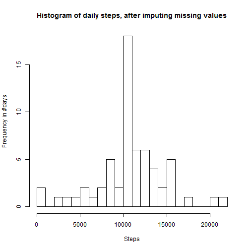
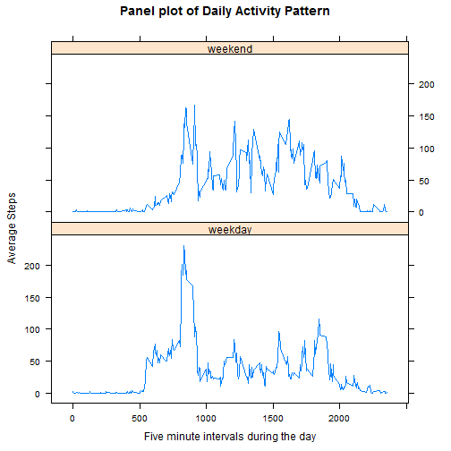

# DSC - Reproducible Research - Assignment 1
[Author: Prashant Ratnaparkhi]

This is a report on walking activity of an individual, using the data generated by the personal activity monitoring device, worn by the individual. 
The data consists of two months of data from an anonymous individual collected during the months of October and November, 2012 (a total of 61 days) and include the number of steps taken in 5 minute intervals each day. 
The dataset has three fields - steps, date and interval. The intervals are labelled as 0,5,10,15,20,25,30,35,40,45,50,55 to represent the twelve 5 minutes intervals within an hour. Hours during the day are marked from 0 thru 23. 
Hence the intervals are: 
- 1st hour of the day: 0,5,10,15,20,25,30,35,40,45,50,55. 
- 2nd hour of the day: 100,105,110,115,120,125,130,135,140,145,150,155. 
- ... and 
- last (24th) hour of the day - 2300,2305,2310,2315,2320,2325,2330,2335,2340,2345,2350,2355.

## Section 1 -  Loading and preprocessing the data. 
 

```r
setwd("d:\\prashant\\coursera-dsc\\datasciencecoursera\\RepData_PeerAssessment1")
unzip("activity.zip")
actd <- read.csv("activity.csv", header = TRUE)
```

## Section 2 -  Histogram, mean & median of the total numbers of steps taken per day. 
[Note: Values marked NA are ignored here.]

### Section 2.1 - Histogram of total number of steps taken per day.

```r
actd1 = as.data.frame(xtabs(steps ~ date, data = actd))
names(actd1)[2] = "steps"
hist(actd1$steps, main = "Histogram of daily steps from Oct 1, 2012 to Nov 30 2012", 
    xlab = "Steps", ylab = "Frequency in #days", breaks = 25)
```

 


### Section 2.2 -  Mean and median total number of steps taken per day. 
 

```r
mn = mean(actd1$steps)
md = median(actd1$steps)
```


- **The mean of total number of steps taken: 9354.2295.**
- **The median of total number of steps taken: 1.0395 &times; 10<sup>4</sup>.**
 
## Section 3 - Average daily activity pattern 

### Section 3.1 - The plot below shows daily activity pattern using a timeseries plot 
[Note: The 5-minute intervals are on x-axis, and the average number of steps taken, averaged across all days are on y-axis]


```r
library(reshape2)
mactd <- melt(actd, id = c("date", "interval"), message.vars = vars)
avgSteps <- dcast(mactd, interval ~ variable, mean, na.rm = TRUE)

# Plot interval Vs steps
plot(avgSteps$interval, avgSteps$steps, type = "l", main = "Daily Activity Pattern", 
    xlab = "Five minute intervals during the day", ylab = "Average Steps")
```

 


### Section 3.2 - Interval with the maximum average of number of steps


```r
mInt = avgSteps[avgSteps$steps == max(avgSteps$steps), ]$interval
```


**Interval with the maximum average of number of steps is: 835.**

## Section 4 - Imputing missing (NA) values
There are a number of days/intervals where there are missing values (coded as NA). The presence of missing days may introduce bias into some calculations or summaries of the data. Missing values are imputed here and mean/median calculated and histogram is plotted.

### Section 4.1 - Total number missing values (i.e. the total number of rows with NAs)


```r
good1 = complete.cases(actd$steps, actd$date, actd$interval)
numNAs = sum(!good1)
```


**Total number of rows with NAs: 2304.**

### Section 4.2 - Imputing missing values
Missing values are set to the mean of for the respective 5-minute interval found in Section 3.1


```r
# Do these values differ from the estimates from the first part of the
# assignment? What is the impact of imputing missing data on the estimates
# of the total daily number of steps?

lng = dim(actd)[1]
for (i in 1:lng) {
    if (is.na(actd$steps[i] == TRUE)) {
        # steps are NA, get corresponding interval and avg steps.
        intrvl = actd$interval[i]
        stp = avgSteps[avgSteps$interval == intrvl, ]$steps
        actd$steps[i] = round(stp)
    }
}

# Aggregate the data from interval to per day.
actd2 = as.data.frame(xtabs(steps ~ date, data = actd))
names(actd2)[2] = "steps"
hist(actd2$steps, main = "Histogram of daily steps from Oct 1, 2012 to Nov 30 2012", 
    xlab = "Steps", ylab = "Frequency in #days", breaks = 25)
```

 


### Section 4.3 - Mean and median calculations after imputing missing values 


```r
mn1 = mean(actd2$steps)
md1 = median(actd2$steps)
```


- **The mean of total number of steps taken: 1.0766 &times; 10<sup>4</sup>.**
- **The median of total number of steps taken: 1.0762 &times; 10<sup>4</sup>.**

The mean and median values after imputing data are larger than the mean and median without imputing missing values(reported in Section 2.2). 
The histogram seems more normal after imputing missing values. 


## Section 5 - Differences in activity patterns between weekdays and weekends. 
There are a total of 45 weekdays (Monday thru Friday) and 16 weekend days (Saturday & Sunday) in the given period. 

The two timeseries plots, below, show the activity patterns on weekdays and weekends. 

The activity is more spread-out over the different intervals on the weekend as compared to weekdays. 


```r
day1 = strptime(actd$date, format = "%Y-%m-%d")
days = as.factor(weekdays(day1))
levels(days)[3:4] = "weekend"
levels(days)[4:6] = "weekday"
levels(days)[1:2] = "weekday"
actd$days = days
# Make two data frame - one for weekday days and other for weekend days.
wkDay <- actd[actd$days == "weekday", ][1:3]
wendDay <- actd[actd$days == "weekend", ][1:3]

library(reshape2)
mactd1 <- melt(wkDay, id = c("date", "interval"), message.vars = vars)
avgSteps1 <- dcast(mactd1, interval ~ variable, mean, na.rm = TRUE)

mactd2 <- melt(wendDay, id = c("date", "interval"), message.vars = vars)
avgSteps2 <- dcast(mactd2, interval ~ variable, mean, na.rm = TRUE)

# Create two plots - interval Vs steps
par(mfcol = c(2, 1))
plot(avgSteps1$interval, avgSteps1$steps, type = "l", main = "Weekday Daily Activity Pattern", 
    xlab = "Five minute intervals during the day", ylab = "Average Steps")
plot(avgSteps2$interval, avgSteps2$steps, type = "l", main = "Weekend Daily Activity Pattern", 
    xlab = "Five minute intervals during the day", ylab = "Average Steps")
```

 

